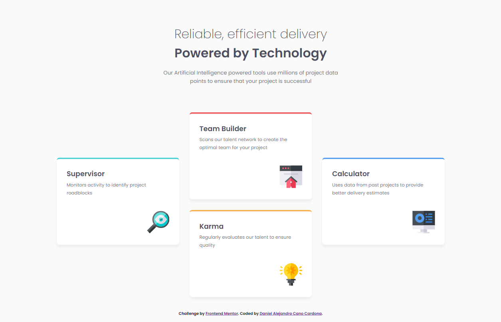

# Frontend Mentor - Four card feature section solution

This is a solution to the **[Four card feature section challenge on Frontend Mentor](https://www.frontendmentor.io/challenges/four-card-feature-section-weK1eFYK)** by **[Dacardonac](https://github.com/Dacardonac)**. Frontend Mentor challenges help you improve your coding skills by building realistic projects.

## Table of contents

- [Frontend Mentor - Four card feature section solution](#frontend-mentor---four-card-feature-section-solution)
  - [Table of contents](#table-of-contents)
  - [Overview](#overview)
    - [The challenge](#the-challenge)
    - [Screenshot](#screenshot)
    - [Links](#links)
  - [My process](#my-process)
    - [Built with](#built-with)
    - [What I learned](#what-i-learned)
    - [Continued development](#continued-development)
    - [Useful resources](#useful-resources)
  - [Author](#author)
  - [Acknowledgments](#acknowledgments)

## Overview

### The challenge

**Users should be able to see in this project:**

- View the optimal layout depending on their device's screen size (Responsive)
- Styles in Components (Sass/Scss)

### Screenshot



### Links

- Solution URL: **[Frontend Mentor Solution](https://www.frontendmentor.io/solutions/four-card-feature-section-html-scss-e8EN8Mzjk3)**
- Live Site URL: **[Solution Deploy](https://fem-four-card-feature-section-wine.vercel.app/)**

## My process

### Built with

- Semantic HTML5 Markup
- CSS3 Custom Properties
- Flexbox
- Mobile-first Workflow
- [Vite](https://vitejs.dev/) - Frontend Tooling
- [Sass/Scss](https://sass-lang.com/) - Modules

### What I learned

I learned and implemented `display: grid;`, along with its properties and how to use it. I also reinforced and practiced my CSS knowledge with Sass, and worked on semantic HTML while applying the BEM methodology for class naming."

You can see an example below:

```html
<!-- Semantic Structure with BEM Methodology -->
    <section class="content">
      <article class=" content__card content__card--supervisor">
        <h2 class="content__card-title">Supervisor</h2>
        <p class="content__card-description">Monitors activity to identify project roadblocks</p>
        <figure class="content__card-image">
          
        </figure>
      </article>
    </section>
```

```css
/* Display: grid; */
@media (min-width: 1440px) {
  .content {
    max-width: 69.375rem;
    display: grid;
    grid-template-areas:
      "          .              team                .          "
      "      supervisor         karma          calculator      ";
    grid-gap: 1.875rem;
    justify-content: center;
    align-items: center;

    &__card {
      max-width: 21.875rem;
      height: 15.625rem;
      margin: 0;
    }

    &__card-image  {
      margin-top: 2.5rem;

      &-img {
        width: 4rem;
        height: auto;
      }
    }

    &__card--supervisor {
      grid-area: supervisor;
      transform: translateY(-150px);
    }

    &__card--team {
      grid-area: team;
    }

    &__card--karma {
      grid-area: karma;
    }

    &__card--calculator {
      grid-area: calculator;
      transform: translateY(-150px);
    }
  }
}
```

### Continued development

With this path, I want to continue learning more about **Responsive Design** and how to work across different devices with **Flexbox** and **Grid**, also I want continue using  **BEM methodology** and perfect the technique in aspects like name the classes, also I want to improve in modularize the component's styles with **Sass** and learn about **Conventional Commits**.

### Useful resources

- **[MDN](https://developer.mozilla.org/en-US/)** - This helped me with **Documentation** on many topics, mostly with **HTML** and **CSS** properties.
- **[ChatGPT](https://chatgpt.com/)** - This is an incredible **Artificial Intelligence (AI)** tool, **ChatGPT** helps me with **specific topics**, **errors in the project** and **investigations**.

## Author

- Frontend Mentor - **[@Dacardonac](https://www.frontendmentor.io/profile/Dacardonac)**
- LinkedIn - **[@Daniel Alejandro Cano Cardona](https://www.linkedin.com/in/daniel-alejandro-cano-cardona/)**

## Acknowledgments

I want to thank **[Jairovg](https://github.com/jairovg)** for the teachings and his help to complete this challenge in a good way and with good practices.